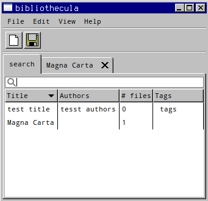
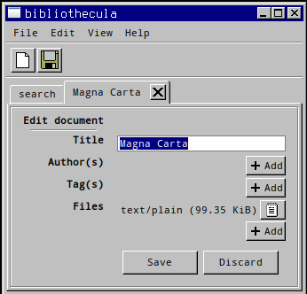

# bibliothecula

> *bibliothēcula* f (genitive *bibliothēculae*); first declension (Late Latin)
>
> - small library
> - small collection of books

Organise documents with tags and other metadata in multiple alternate formats.

