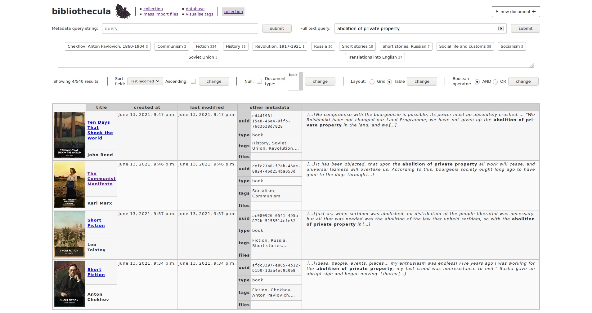
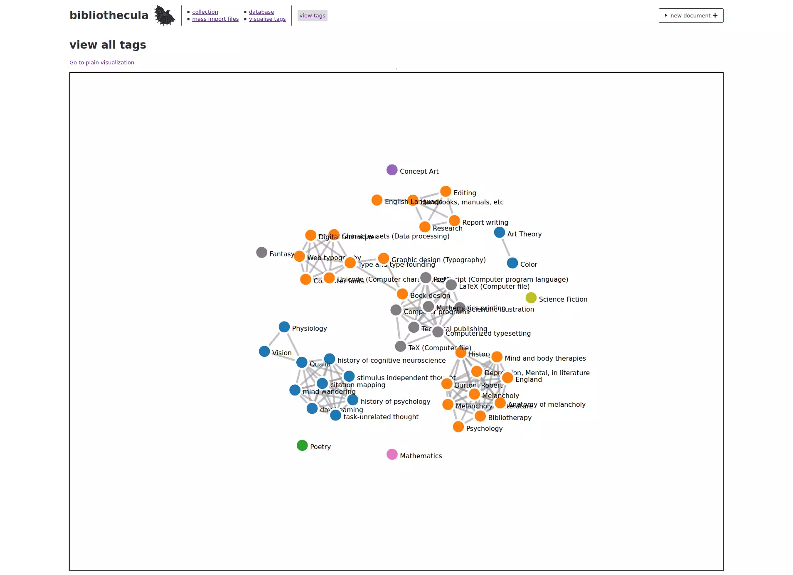

# bumblebat app

## Screenshots

See non-interactive/static HTML demos here: <https://epilys.github.io/bibliothecula/web-demo/index.html>

<table>
	<tbody>
		<tr>
			<td><kbd></kbd></td>
			<td><kbd></kbd></td>
		</tr>
		<tr>
			<th>Grid view</th>
			<th>Document view</th>
		</tr>
		<tr>
			<td><p align="center"><kbd></kbd></p></td>
			<td><kbd></kbd></td>
		</tr>
		<tr>
			<th>Full-text search on grid view</th>
			<th>and on table view</th>
		</tr>
		<tr>
			<td><p align="center"><kbd></kbd></p></td>
			<td><kbd></kbd></td>
		</tr>
		<tr>
			<th>Database info and reference</th>
			<th>d3.js tag graph</th>
		</tr>
	</tbody>
</table>

## Dependencies

Requires:

1. `python3`
2. `django`

   , and optionally:

3. `matplotlib` for graphs
4. `wand` (ImageMagick) for thumbnails and `gs` (Ghostscript) for PDF page to image conversion
5. `pdfminer.six` for extraction of pdf text for full-text search indexing

## Use

The database's location is assumed to be named `bibliothecula.db` and in the same directory as the `manage.py` script, otherwise define the environment variable `BIBLIOTHECULA_DB` with a path relative to `manage.py` or an absolute path like in the following examples:

### Using `./bibliothecula.db`

```shell
python3.7 manage.py runserver
```

### Using `../art.db`

```shell
BIBLIOTHECULA_DB=../art.db python3.7 manage.py runserver
```

### Using `/home/user/Documents/business_papers.db`

```shell
BIBLIOTHECULA_DB=~/Documents/business_papers.db python3.7 manage.py runserver
```

## Example scripts

See `examples/` directory for example scripts using the `django` models:

- `examples/standardebooks.py` import `epub` ebooks from <https://standardebooks.org/>
