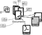

# bibliothecula schema overview

## Contents:

<table>
<tr><th>1</th><td><a href="#overview">Overview</a></td></tr>
<tr><th>2</th><td><a href="#sql-schema-reference">SQL schema reference</a></td></tr>
<tr><th>3</th><td><a href="#sql-statements-reference">SQL statements reference</a></td></tr>
<tr><th>4</th><td><a href="#sqlite-cli-reference"><code>sqlite</code> CLI reference</a></td></tr>
</table>

## Overview

Egone quaeris, inquit, quid sentiam? quos bonos viros, fortes, iustos,
moderatos aut audivimus in re publica fuisse aut ipsi vidimus, qui sine
ulla doctrina naturam ipsam secuti multa laudabilia fecerunt, eos melius
a natura institutos fuisse, quam institui potuissent a philosophia, si
ullam aliam probavissent praeter eam, quae nihil aliud in bonis haberet
nisi honestum, nihil nisi turpe in malis; ceterae philosophorum
disciplinae, omnino alia magis alia, sed tamen omnes, quae rem ullam
virtutis expertem aut in bonis aut in malis numerent, eas non modo nihil
adiuvare arbitror neque firmare, quo meliores simus, sed ipsam depravare
naturam. nam nisi hoc optineatur, id solum bonum esse, quod honestum
sit, nullo modo probari possit beatam vitam virtute effici. quod si ita
sit, cur opera philosophiae sit danda nescio. si enim sapiens aliquis
miser esse possit, ne ego istam gloriosam memorabilemque virtutem non
magno aestimandam putem.

Dicuntur ista, Cato, magnifice, inquam, sed videsne verborum gloriam
tibi cum Pyrrhone et cum Aristone, qui omnia exaequant, esse communem?
de quibus cupio scire quid sentias.

We come now to *metaphysics*, a purely speculative science, which
occupies a completely isolated position and is entirely independent of
the teachings of experience. It deals with mere conceptions—not, like
mathematics, with conceptions applied to intuition—and in it, reason is
the pupil of itself alone. It is the oldest of the sciences, and would
still survive, even if all the rest were swallowed up in the abyss of an
all-destroying barbarism. But it has not yet had the good fortune to
attain to the sure scientific method. This will be apparent; if we apply
the tests which we proposed at the outset. We find that reason
perpetually comes to a stand, when it attempts to gain \_à priori\_ the
perception even of those laws which the most common experience confirms.
We find it compelled to retrace its steps in innumerable instances, and
to abandon the path on which it had entered, because this does not lead
to the desired result. We find, too, that those who are engaged in
metaphysical pursuits are far from being able to agree among themselves,
but that, on the contrary, this science appears to furnish an arena
specially adapted for the display of skill or the exercise of strength
in mock-contests—a field in which no combatant ever yet succeeded in
gaining an inch of ground, in which, at least, no victory was ever yet
crowned with permanent possession.

This leads us to inquire why it is that, in metaphysics, the sure path
of science has not hitherto been found. Shall we suppose that it is
impossible to discover it? Why then should nature have visited our
reason with restless aspirations after it, as if it were one of our
weightiest concerns? Nay, more, how little cause should we have to place
confidence in our reason, if it abandons us in a matter about which,
most of all, we desire to know the truth—and not only so, but even
allures us to the pursuit of vain phantoms, only to betray us in the
end? Or, if the path has only hitherto been missed, what indications do
we possess to guide us in a renewed investigation, and to enable us to
hope for greater success than has fallen to the lot of our
predecessors?

## SQL schema reference

<table>
<caption>
The bibliothecula schema.
</caption>

<thead>
<tr>
<th>name</th>
<th>value</th>
</tr>
</thead>

<tbody>
<tr>
<th class="blue">CREATE_DOCUMENTS</th>
<td class="sql"><pre class="sql">
<b>CREATE</b> <b>TABLE</b> <b>IF</b> <b>NOT</b> <b>EXISTS</b>
"Documents"<b>(</b>
  "uuid" <b>CHAR</b><b>(</b>32<b>)</b> <b>NOT</b> <b>NULL</b> <b>PRIMARY</b> <b>KEY</b><b>,</b>
  "title" <b>TEXT</b> <b>NOT</b> <b>NULL</b><b>,</b>
  "title_suffix" <b>TEXT</b><b>,</b>
  "created" <b>DATETIME</b> <b>NOT</b> <b>NULL</b> <b>DEFAULT</b><b>(</b>strftime<b>(</b>'%Y-%m-%d %H:%M:%f'<b>,</b> 'now'<b>)</b><b>)</b><b>,</b>
  "last_modified" <b>DATETIME</b> <b>NOT</b> <b>NULL</b> <b>DEFAULT</b><b>(</b>strftime<b>(</b>'%Y-%m-%d %H:%M:%f'<b>,</b> 'now'<b>)</b><b>)</b>
  <b>)</b><b>;</b></pre>
</td>
</tr>

<tr>
<th class="blue">CREATE_TEXTMETADATA</th>
<td class="sql"><pre class="sql">
<b>CREATE</b> <b>TABLE</b> <b>IF</b> <b>NOT</b> <b>EXISTS</b>
"TextMetadata"<b>(</b>
  "uuid" <b>CHAR</b><b>(</b>32<b>)</b> <b>NOT</b> <b>NULL</b> <b>PRIMARY</b> <b>KEY</b><b>,</b>
  "name" <b>TEXT</b> <b>NULL</b><b>,</b>
  "data" <b>TEXT</b> <b>NOT</b> <b>NULL</b><b>,</b>
  "created" <b>DATETIME</b> <b>NOT</b> <b>NULL</b><b>,</b>
  "last_modified" <b>DATETIME</b> <b>NOT</b> <b>NULL</b>
  <b>)</b><b>;</b></pre>
</td>
</tr>

<tr>
<th class="blue">CREATE_DOCUMENTHASTEXTMETADATA</th>
<td class="sql"><pre class="sql">
<b>CREATE</b> <b>TABLE</b> <b>IF</b> <b>NOT</b> <b>EXISTS</b>
"DocumentHasTextMetadata"<b>(</b>
  "id" <b>INTEGER</b> <b>NOT</b> <b>NULL</b> <b>PRIMARY</b> <b>KEY</b> <b>AUTOINCREMENT</b><b>,</b>
  "name" <b>TEXT</b> <b>NOT</b> <b>NULL</b><b>,</b>
  "document_uuid" <b>CHAR</b><b>(</b>32<b>)</b> <b>NOT</b> <b>NULL</b> <b>REFERENCES</b> "Documents"<b>(</b>"uuid"<b>)</b> <b>DEFERRABLE</b> <b>INITIALLY</b> <b>DEFERRED</b><b>,</b>
  "metadata_uuid" <b>CHAR</b><b>(</b>32<b>)</b> <b>NOT</b> <b>NULL</b> <b>REFERENCES</b> "TextMetadata"<b>(</b>"uuid"<b>)</b> <b>DEFERRABLE</b> <b>INITIALLY</b> <b>DEFERRED</b><b>,</b>
  "created" <b>DATETIME</b> <b>NOT</b> <b>NULL</b> <b>DEFAULT</b><b>(</b>strftime<b>(</b>'%Y-%m-%d %H:%M:%f'<b>,</b> 'now'<b>)</b><b>)</b><b>,</b>
  "last_modified" <b>DATETIME</b> <b>NOT</b> <b>NULL</b> <b>DEFAULT</b><b>(</b>strftime<b>(</b>'%Y-%m-%d %H:%M:%f'<b>,</b> 'now'<b>)</b><b>)</b>
  <b>)</b><b>;</b></pre>
</td>
</tr>

<tr>
<th class="blue">CREATE_BINARYMETADATA</th>
<td class="sql"><pre class="sql">
<b>CREATE</b> <b>TABLE</b> <b>IF</b> <b>NOT</b> <b>EXISTS</b>
"BinaryMetadata"<b>(</b>
  "uuid" <b>CHAR</b><b>(</b>32<b>)</b> <b>NOT</b> <b>NULL</b> <b>PRIMARY</b> <b>KEY</b><b>,</b>
  "name" <b>TEXT</b> <b>NULL</b><b>,</b>
  "data" <b>BLOB</b> <b>NOT</b> <b>NULL</b><b>,</b>
  "created" <b>DATETIME</b> <b>NOT</b> <b>NULL</b><b>,</b>
  "last_modified" <b>DATETIME</b> <b>NOT</b> <b>NULL</b>
  <b>)</b><b>;</b></pre>
</td>
</tr>

<tr>
<th class="blue">CREATE_DOCUMENTHASBINARYMETADATA</th>
<td class="sql"><pre class="sql">
<b>CREATE</b> <b>TABLE</b> <b>IF</b> <b>NOT</b> <b>EXISTS</b>
"DocumentHasBinaryMetadata"<b>(</b>
  "id" <b>INTEGER</b> <b>NOT</b> <b>NULL</b> <b>PRIMARY</b> <b>KEY</b> <b>AUTOINCREMENT</b><b>,</b>
  "name" <b>TEXT</b> <b>NOT</b> <b>NULL</b><b>,</b>
  "document_uuid" <b>CHAR</b><b>(</b>32<b>)</b> <b>NOT</b> <b>NULL</b> <b>REFERENCES</b> "Documents"<b>(</b>"uuid"<b>)</b> <b>DEFERRABLE</b> <b>INITIALLY</b> <b>DEFERRED</b><b>,</b>
  "metadata_uuid" <b>CHAR</b><b>(</b>32<b>)</b> <b>NOT</b> <b>NULL</b> <b>REFERENCES</b> "BinaryMetadata"<b>(</b>"uuid"<b>)</b> <b>DEFERRABLE</b> <b>INITIALLY</b> <b>DEFERRED</b><b>,</b>
  "created" <b>DATETIME</b> <b>NOT</b> <b>NULL</b> <b>DEFAULT</b><b>(</b>strftime<b>(</b>'%Y-%m-%d %H:%M:%f'<b>,</b> 'now'<b>)</b><b>)</b><b>,</b>
  "last_modified" <b>DATETIME</b> <b>NOT</b> <b>NULL</b> <b>DEFAULT</b><b>(</b>strftime<b>(</b>'%Y-%m-%d %H:%M:%f'<b>,</b> 'now'<b>)</b><b>)</b>
  <b>)</b><b>;</b></pre>
</td>
</tr>
</tbody>
</table>

## SQL statements reference

A list of utility SQL statements for use with the **bibliothecula** schema.

<table>
<thead>
<tr>
<th colspan="2">name</th>
<th>documentation</th>
<th>value</th>
</tr>
</thead>

<tbody>
<tr>
<td><em>index</em>, <em>example</em></td>
<th class="blue">CREATE_BACKREF_INDEX</th>
<td class="doc">Create backref index.</td>
<td class="sql"><pre class="sql">
<b>CREATE</b> <b>VIRTUAL</b> <b>TABLE</b> backrefs_fts <b>USING</b> fts5<b>(</b>referrer<b>,</b> target<b>)</b><b>;</b></pre>
</td>
</tr>

<tr>
<td><em>create table</em>, <em>index</em></td>
<th class="blue">CREATE_UUID_TOKENIZER</th>
<td class="doc"><cite><a rel="external nofollow noreferrer" href="https://www.sqlite.org/fts3.html#querying_tokenizers">sqlite3 reference</a></cite>
</td>
<td class="sql"><pre class="sql">
<b>CREATE</b> <b>VIRTUAL</b> <b>TABLE</b> <b>IF</b> <b>NOT</b> <b>EXISTS</b>
uuidtok <b>USING</b> fts3tokenize<b>(</b>'unicode61'<b>,</b> "tokenchars=-1234567890abcdefghijklmnopqrstuvwxyzABCDEFGHIJKLMNOPQRSTUVWXYZ"<b>,</b> "separators= "<b>)</b><b>;</b></pre>
</td>
</tr>

<tr>
<td><em>create view</em>
</td>
<th class="blue">CREATE_VIEW_DOCUMENTS_TITLE_AUTHORS</th>
<td class="doc">Auxiliary view for use in <var>document_title_authors_text_view</var> view. Returns document title and a comma separated string with all authors or NULL for all documents. <cite><a rel="external nofollow noreferrer" href="https://sqlite.org/lang_createview.html">sqlite3 reference for for creating views</a></cite></td>
<td class="sql"><pre class="sql">
<b>CREATE</b> <b>VIEW</b> <b>IF</b> <b>NOT</b> <b>EXISTS</b>
document_title_authors<b>(</b>rowid<b>,</b> title<b>,</b> authors<b>)</b> <b>AS</b>
<b>SELECT</b> <b>*</b> <b>FROM</b> document_title_without_authors
<b>UNION</b> <b>SELECT</b> <b>*</b> <b>FROM</b> document_title_with_authors</pre>
</td>
</tr>

<tr>
<td><em>create view</em>
</td>
<th class="blue">CREATE_VIEW_DOCUMENT_TITLE_AUTHORS_TEXT</th>
<td class="doc">Auxiliary view for use in <abbr title="Full-Text Search">FTS</abbr> create trigger. Returns document title, a comma separated string with all authors or NULL if there aren't any. and the full text blob for all documents. <cite><a rel="external nofollow noreferrer" href="https://sqlite.org/lang_createview.html">sqlite3 reference for for creating views</a></cite></td>
<td class="sql"><pre class="sql">
<b>CREATE</b> <b>VIEW</b> <b>IF</b> <b>NOT</b> <b>EXISTS</b>
document_title_authors_text_view<b>(</b>rowid<b>,</b> title<b>,</b> authors<b>,</b> full_text<b>,</b> metadata_uuid<b>)</b> <b>AS</b>
<b>SELECT</b> v.rowid <b>AS</b> uuid<b>,</b>
v.title <b>AS</b> title<b>,</b>
v.authors <b>AS</b> authors<b>,</b>
bm.data <b>AS</b> full_text<b>,</b>
bm.uuid <b>AS</b> metadata_uuid
<b>FROM</b> document_title_authors <b>AS</b> v<b>,</b>
DocumentHasBinaryMetadata <b>AS</b> dhbm<b>,</b>
BinaryMetadata <b>AS</b> bm
<b>WHERE</b> bm.uuid <b>=</b> dhbm.metadata_uuid
<b>AND</b> v.uuid <b>=</b> dhbm.document_uuid
<b>AND</b> dhbm.name <b>=</b> 'full-text'
<b>ORDER</b> <b>BY</b> dhbm.last_modified</pre>
</td>
</tr>

<tr>
<td><em>create view</em>
</td>
<th class="blue">CREATE_VIEW_WITHOUT_AUTHORS</th>
<td class="doc">Auxiliary view for use in <var>document_title_authors</var> view. Returns document title and NULL for all documents that have no <var>author</var> metadata. <cite><a rel="external nofollow noreferrer" href="https://sqlite.org/lang_createview.html">sqlite3 reference for for creating views</a></cite></td>
<td class="sql"><pre class="sql">
<b>CREATE</b> <b>VIEW</b> <b>IF</b> <b>NOT</b> <b>EXISTS</b>
document_title_without_authors<b>(</b>rowid<b>,</b> title<b>,</b> authors<b>)</b> <b>AS</b>
<b>SELECT</b> d.uuid <b>AS</b> uuid<b>,</b> d.title <b>AS</b> title<b>,</b> <b>NULL</b> <b>AS</b> authors
<b>FROM</b> Documents <b>AS</b> d
<b>WHERE</b> <b>NOT</b> <b>EXISTS</b>
<b>(</b><b>SELECT</b> <b>*</b> <b>FROM</b> TextMetadata <b>AS</b> t<b>,</b> DocumentHasTextMetadata <b>AS</b> dt <b>WHERE</b> t.name <b>=</b> 'author' <b>AND</b> t.uuid <b>=</b> dt.metadata_uuid <b>AND</b> dt.document_uuid <b>=</b> d.uuid<b>)</b></pre>
</td>
</tr>

<tr>
<td><em>create view</em>
</td>
<th class="blue">CREATE_VIEW_WITH_AUTHORS</th>
<td class="doc">Auxiliary view for use in <var>document_title_authors</var> view. Returns document title and a comma separated string with all authors for all documents that have <var>author</var> metadata. <cite><a rel="external nofollow noreferrer" href="https://sqlite.org/lang_createview.html">sqlite3 reference for for creating views</a></cite></td>
<td class="sql"><pre class="sql">
<b>CREATE</b> <b>VIEW</b> <b>IF</b> <b>NOT</b> <b>EXISTS</b>
document_title_with_authors<b>(</b>rowid<b>,</b> title<b>,</b> authors<b>)</b> <b>AS</b>
<b>SELECT</b> d.uuid <b>AS</b> uuid<b>,</b> d.title <b>AS</b> title<b>,</b> GROUP_CONCAT<b>(</b>authors.author<b>)</b> <b>AS</b> authors
<b>FROM</b> Documents <b>AS</b> d<b>,</b>
<b>(</b><b>SELECT</b> d.uuid <b>AS</b> uuid<b>,</b> tm.data <b>AS</b> author <b>FROM</b> Documents <b>AS</b> d<b>,</b> TextMetadata <b>AS</b> tm<b>,</b> DocumentHasTextMetadata <b>AS</b> dhtm <b>WHERE</b> dhtm.document_uuid <b>=</b> d.uuid <b>AND</b> dhtm.metadata_uuid <b>=</b> tm.uuid <b>AND</b> tm.name <b>=</b> 'author'<b>)</b> <b>AS</b> authors
<b>WHERE</b> authors.uuid <b>=</b> d.uuid
<b>GROUP</b> <b>BY</b> d.uuid</pre>
</td>
</tr>

<tr>
<td><em>index</em>, <em>create trigger</em></td>
<th class="blue">FTS_CREATE_DELETE_TRIGGER</th>
<td class="doc">Trigger to remove a document's full text from the full text search table when the full-text binary metadata is deleted. <cite><a rel="external nofollow noreferrer" href="https://sqlite.org/lang_createtrigger.html">sqlite3 reference for for creating triggers</a></cite></td>
    <td class="sql"><pre class="sql">
<b>CREATE</b> <b>TRIGGER</b> <b>IF</b> <b>NOT</b> <b>EXISTS</b> 
delete_full_text_trigger  
<b>AFTER</b> <b>DELETE</b> <b>ON</b> DocumentHasBinaryMetadata  
<b>WHEN</b> OLD.name <b>=</b> 'full-text' 
<b>BEGIN</b> 
  <b>DELETE</b> <b>FROM</b> document_title_authors_text_view_fts  
  <b>WHERE</b> uuid <b>=</b> OLD.document_uuid<b>;</b> 
<b>END</b></pre></td>
</tr>

<tr>
<td><em>index</em>, <em>create trigger</em></td>
<th class="blue">FTS_CREATE_INSERT_TRIGGER</th>
<td class="doc">Trigger to insert full text data when a <var>DocumentHasBinaryMetadata</var> row for a full-text <var>BinaryMetadata</var> is created. <cite><a rel="external nofollow noreferrer" href="https://sqlite.org/lang_createtrigger.html">sqlite3 reference for for creating triggers</a></cite></td>
<td class="sql"><pre class="sql">
<b>CREATE</b> <b>TRIGGER</b> <b>IF</b> <b>NOT</b> <b>EXISTS</b>
insert_full_text_trigger
<b>AFTER</b> <b>INSERT</b> <b>ON</b> DocumentHasBinaryMetadata
<b>WHEN</b> NEW.name <b>=</b> 'full-text'
<b>BEGIN</b>
  <b>INSERT</b> <b>INTO</b> document_title_authors_text_view_fts<b>(</b>uuid<b>,</b> title<b>,</b> authors<b>,</b> full_text<b>)</b>
  <b>SELECT</b> d.rowid <b>AS</b> rowid<b>,</b> d.title <b>AS</b> title<b>,</b> d.authors <b>AS</b> authors<b>,</b> d.full_text <b>AS</b> full_text
  <b>FROM</b> document_title_authors_text_view <b>AS</b> d
  <b>WHERE</b> d.metadata_uuid <b>=</b> NEW.metadata_uuid
  <b>AND</b> d.rowid=NEW.document_uuid<b>;</b>
<b>END</b></pre></td>
</tr>

<tr>
<td><em>create table</em>, <em>index</em></td>
<th class="blue">FTS_CREATE_TABLE</th>
<td class="doc">Create a full-text search index using the <em>fts5</em> module. <cite><a rel="external nofollow noreferrer" href="https://sqlite.org/fts5.html">sqlite3 reference</a></cite></td>
<td class="sql"><pre class="sql">
<b>CREATE</b> <b>VIRTUAL</b> <b>TABLE</b> <b>IF</b> <b>NOT</b> <b>EXISTS</b>
document_title_authors_text_view_fts <b>USING</b> fts5<b>(</b>title<b>,</b> authors<b>,</b> full_text<b>,</b> uuid <b>UNINDEXED</b><b>)</b></pre>
</td>
</tr>

<tr>
<td><em>index</em>, <em>query data</em></td>
<th class="blue">FTS_INTEGRITY_CHECK</th>
<td class="doc">This command is used to verify that the full-text index is internally consistent. <cite><a rel="external nofollow noreferrer" href="https://sqlite.org/fts5.html#the_integrity_check_command">sqlite3 reference</a></cite></td>
<td class="sql"><pre class="sql">
<b>INSERT</b> <b>INTO</b> document_title_authors_text_view_fts<b>(</b>document_title_authors_text_view_fts<b>)</b> <b>VALUES</b><b>(</b>'integrity-check'<b>)</b></pre>
</td>
</tr>

<tr>
<td><em>index</em>
</td>
<th class="blue">FTS_OPTIMIZE</th>
<td class="doc">This command merges all individual b-trees that currently make up the full-text index into a single large b-tree structure. Because it reorganizes the entire <abbr title="Full-Text Search">FTS</abbr> index, the optimize command can take a long time to run. <cite><a rel="external nofollow noreferrer" href="https://sqlite.org/fts5.html#the_optimize_command">sqlite3 reference</a></cite></td>
<td class="sql"><pre class="sql">
<b>INSERT</b> <b>INTO</b> document_title_authors_text_view_fts<b>(</b>document_title_authors_text_view_fts<b>)</b> <b>VALUES</b><b>(</b>'optimize'<b>)</b></pre>
</td>
</tr>

<tr>
<td><em>index</em>
</td>
<th class="blue">FTS_REBUILD</th>
<td class="doc">This command first deletes the entire full-text index, then rebuilds it. <cite><a rel="external nofollow noreferrer" href="https://sqlite.org/fts5.html#the_rebuild_command">sqlite3 reference</a></cite></td>
<td class="sql"><pre class="sql">
<b>INSERT</b> <b>INTO</b> document_title_authors_text_view_fts<b>(</b>document_title_authors_text_view_fts<b>)</b> <b>VALUES</b><b>(</b>'rebuild'<b>)</b></pre>
</td>
</tr>

<tr>
<td><em>index</em>, <em>query data</em></td>
<th class="blue">FTS_SEARCH</th>
<td class="doc">This command queries the full-text search index for documents. <cite><a rel="external nofollow noreferrer" href="https://sqlite.org/fts5.html">sqlite3 reference</a></cite></td>
<td class="sql"><pre class="sql">
<b>SELECT</b> uuid <b>FROM</b> document_title_authors_text_view_fts<b>(</b>'query text'<b>)</b></pre>
</td>
</tr>

<tr>
<td><em>index</em>, <em>query data</em></td>
<th class="blue">FTS_SELECT_CONFIG</th>
<td class="doc">This command returns the values of persistent configuration parameters. <cite><a rel="external nofollow noreferrer" href="https://sqlite.org/fts5.html#appendix_b">sqlite3 reference</a></cite></td>
<td class="sql"><pre class="sql">
<b>SELECT</b> <b>*</b> <b>FROM</b> document_title_authors_text_view_fts_config</pre>
</td>
</tr>

<tr>
<td><em>query data</em>, <em>example</em></td>
<th class="blue">QUERY_BACKREFS_FROM_TEXT_FILES</th>
<td class="doc">Find backreferences from plain text files.</td>
<td class="sql"><pre class="sql">
<b>SELECT</b> <b>DISTINCT</b> <b>REPLACE</b><b>(</b>tok.token<b>,</b> '-'<b>,</b> ''<b>)</b> <b>AS</b> target<b>,</b>
texts.uuid <b>AS</b> referrer <b>FROM</b> uuidtok <b>AS</b> tok<b>,</b>
<b>(</b><b>SELECT</b> uuid<b>,</b> data<b>,</b>
json_extract<b>(</b>name<b>,</b> '$.content_type'<b>)</b> <b>AS</b> _type
<b>FROM</b> BinaryMetadata
<b>WHERE</b> json_valid<b>(</b>name<b>)</b> <b>AND</b> _type <b>LIKE</b> "%text/%"<b>)</b>
<b>AS</b> texts
<b>WHERE</b> tok.input=texts.data <b>AND</b> LENGTH<b>(</b>tok.token<b>)</b> <b>=</b> 36
<b>AND</b> <b>EXISTS</b>
<b>(</b><b>SELECT</b> <b>*</b> <b>FROM</b> Documents <b>WHERE</b> uuid <b>=</b> <b>REPLACE</b><b>(</b>tok.token<b>,</b> '-'<b>,</b> ''<b>)</b><b>)</b><b>;</b></pre>
</td>
</tr>

<tr>
<td><em>query data</em>, <em>example</em></td>
<th class="blue">QUERY_BACKREF_CANDIDATES</th>
<td class="doc">
</td>
<td class="sql"><pre class="sql">
<b>SELECT</b> <b>DISTINCT</b> token <b>FROM</b> uuidtok
<b>WHERE</b> input <b>=</b>
<b>(</b><b>SELECT</b> data <b>FROM</b> BinaryMetadata
<b>WHERE</b> uuid <b>=</b> '17ee75452e574e03b0b8e4ef2bc9be25'<b>)</b>
<b>AND</b> LENGTH<b>(</b>token<b>)</b> <b>=</b> 36<b>;</b></pre>
</td>
</tr>

<tr>
<td><em>query data</em>, <em>example</em></td>
<th class="blue">QUERY_TEXT_FILES</th>
<td class="doc">
</td>
<td class="sql"><pre class="sql">
<b>SELECT</b> uuid<b>,</b> name<b>,</b> json_extract<b>(</b>name<b>,</b> '$.content_type'<b>)</b> <b>AS</b> _type
<b>FROM</b> BinaryMetadata
<b>WHERE</b> json_valid<b>(</b>name<b>)</b>
<b>AND</b> _type <b>LIKE</b> "%text/%"<b>;</b></pre>
</td>
</tr>

<tr>
<td><em>query data</em>, <em>example</em></td>
<th class="blue">QUERY_UUID_WITH_HYPHENS</th>
<td class="doc">
</td>
<td class="sql"><pre class="sql">
<b>SELECT</b> <b>*</b> <b>FROM</b> Documents
<b>WHERE</b> uuid <b>=</b>
<b>REPLACE</b><b>(</b>'7ec63f30-5882-46ac-855d-bdcaf8f29700'<b>,</b> '-'<b>,</b> ''<b>)</b><b>;</b></pre>
</td>
</tr>

<tr>
<td><em>query data</em>, <em>example</em></td>
<th class="blue">QUERY_VALID_JSON_NAMES</th>
<td class="doc">
</td>
<td class="sql"><pre class="sql">
<b>SELECT</b> uuid<b>,</b> name <b>FROM</b> BinaryMetadata <b>WHERE</b> json_valid<b>(</b>name<b>)</b><b>;</b></pre>
</td>
</tr>
</tbody>
</table>

## `sqlite` CLI reference

A list of utility SQL statements for use with the CLI tool.
